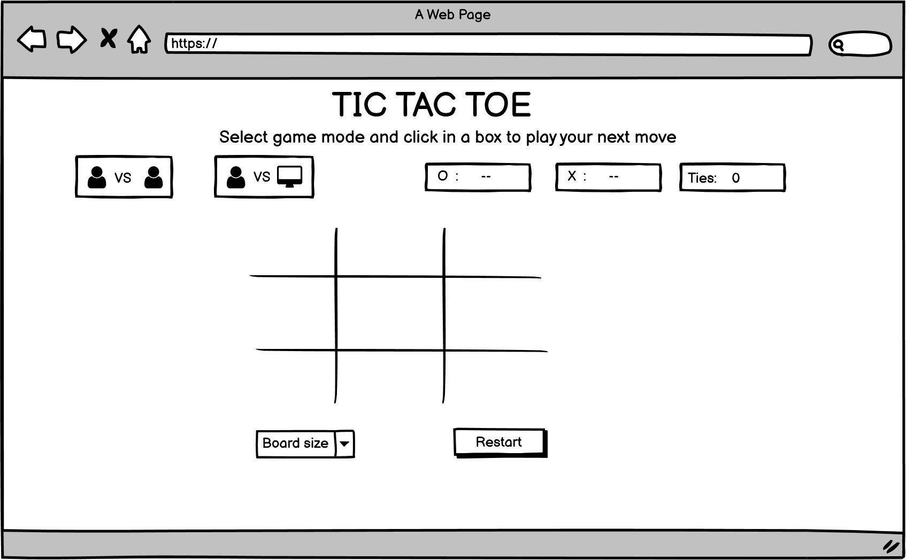
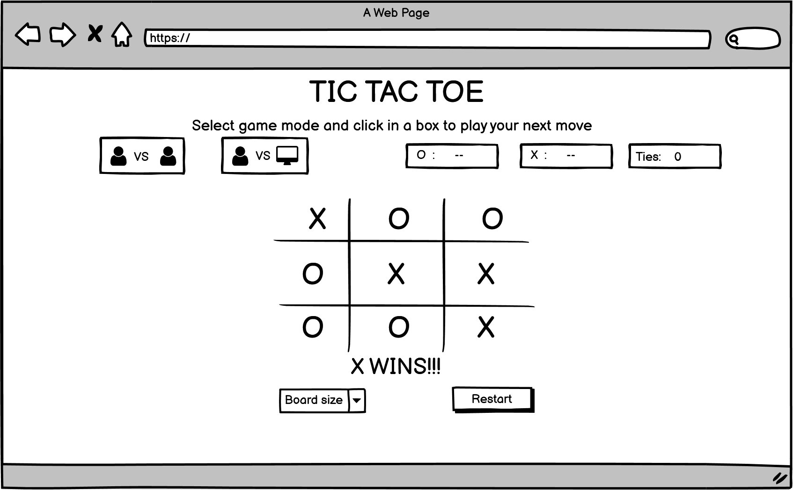

<h1 align="center">TIC TAC TOE</h1>

[View the live project here.](#)

The site provides a simple tic tac toe game played between two players on a 3 by 3 or 4 by 4 grid.

<h2 align="center"></h2>

## User Experience (UX)

-   ### User stories

    -   #### First Time Visitor Goals

        As a First Time Visitor, I want to:
        - I want to understand the site's main purpose and find out what features it provides
        - Easily navigate the pages
        - Understand how to play

    -   #### Returning Visitor Goals

        As a Returning Visitor, I want to:
        -  Play a simple web-based tic-tac-toe game
        -  Explore a different grid size

    -   #### Frequent Visitor Goals

        As a frequent Visitor, I want to:
        -  Play tic tac toe with a friend or against a bot
        -  Play the game in turns
        -  have my marker symbol drawn when I click inside an empty cell
        -  know when I have won, lost or drawn the game
        -  restart the game when one ends

-   ### Design

    -   #### Colour Scheme
        -   The main colors chosen are teal, pink and grey.

    -   #### Typography
        -   The Montserrat font is the main font used throughout the whole website with Sans Serif as the fallback font in case for any reason the font isn't being imported into the site correctly. Montserrat is a clean font used frequently in programming, so it is both attractive and appropriate.

*   ### Wireframes
    The wireframes for this project are:

    -   [PDF Wireframe document](docs/wireframes/tictactoe_wireframe.pdf)
    <h2 align="center">Desktop and tablet view</h2>
    <h2 align="center">

    
    </h2>

    <h2 align="center">Mobile View</h2>
    <h2 align="center"></h2>
    

 ## Features

-   Responsive on all device sizes

-   Interactive elements

## Technologies Used
-   [Minimax algorithm](https://www.geeksforgeeks.org/minimax-algorithm-in-game-theory-set-1-introduction/)

### Languages Used

-   [HTML5](https://en.wikipedia.org/wiki/HTML5)
-   [CSS3](https://en.wikipedia.org/wiki/Cascading_Style_Sheets)
-   [JavaScript](https://en.wikipedia.org/wiki/JavaScript)

### Frameworks, Libraries & Programs Used

1. [Git](https://git-scm.com/)
    - Git was used for version control by utilizing the Gitpod terminal to commit to Git and Push to GitHub.
2. [GitHub:](https://github.com/)
    - GitHub is used to store the projects code after being pushed from Git.
3. [Balsamiq:](https://balsamiq.com/)
    - Balsamiq was used to create the wireframes during the design process.

## Testing

The W3C Markup Validator and W3C CSS Validator Services were used to validate every page of the project to ensure there were no syntax errors in the project.

-   [W3C Markup Validator](https://jigsaw.w3.org/css-validator/#validate_by_input) - [Results](https://github.com/)
-   [W3C CSS Validator](https://jigsaw.w3.org/css-validator/#validate_by_input) - [Results](https://github.com/)

### Testing User Stories from User Experience (UX) Section

-   #### First Time Visitor Goals

    1. As a First Time Visitor, I want to understand the site's main purpose and find out what features it provides.

    2. As a First Time Visitor, I want to easily navigate the pages

    3. As a First Time Visitor, I want to understand how to play


-   #### Returning Visitor Goals

    1. As a Returning Visitor, I want to play a simple web-based game.

    2. As a Returning Visitor, I want to other features of the site.
      

### Further Testing 

-   The Website will be tested on Google Chrome, Internet Explorer, Microsoft Edge and Safari browsers.
-   The website will be viewed on a variety of devices such as Desktop, Laptop, iPhone7, iPhone 8 & iPhoneX.
-   A large amount of testing will be done to ensure that all pages were linking correctly.

### Known Bugs


## Deployment

### GitHub Pages

The project will be deployed to GitHub Pages using the following steps...

1. Log in to GitHub and locate the [GitHub Repository](https://github.com/valerieoni/tictactoe)
2. In the GitHub repository, navigate to the Settings tab
3. Scroll down the Settings page until you locate the **Pages** Section.
5. Click on the **Pages** tab close to the bottom of the page
4. Under **Source**, click the dropdown called `none` and select `main` Branch.
5. Click "Save" button to save the changes and this will trigger the site deploymment automatically.
6. When you refresh the page, you will see that the site has been successfully published, along with a link to the published site.

### Forking the GitHub Repository

1. Log in to GitHub and locate the [GitHub Repository](https://github.com/valerieoni/tictactoe)
2. From the top right menu buttons, locate and click the "Fork" Button.
3. You should now have a copy of the original repository in your GitHub account.

### Making a Local Clone

1. Log in to GitHub and locate the [GitHub Repository](https://github.com/valerieoni/tictactoe)
2. Click the `Code` dropdown arrow button just above the list of files.
3. To clone the repository using HTTPS, under "Clone with HTTPS", copy the link.
4. Open Git Bash
5. Change the current working directory to the location where you want the cloned directory to be made.
6. Type `git clone`, and then paste the URL you copied in Step 3.

```
$ git clone https://github.com/valerieoni/tictactoe
```

7. Press Enter. Your local clone will be created.

```
$ git clone https://github.com/valerieoni/tictactoe
> Cloning into `CI-Clone`...
> remote: Counting objects: 10, done.
> remote: Compressing objects: 100% (8/8), done.
> remove: Total 10 (delta 1), reused 10 (delta 1)
> Unpacking objects: 100% (10/10), done.
```

## Credits

### Code

-   [MDN Web Docs](https://developer.mozilla.org/) : For Pattern Validation code. Code was modified to better fit my needs and to match an Irish phone number layout to ensure correct validation. Tutorial Found [Here](https://developer.mozilla.org/en-US/docs/Web/HTML/Element/input/tel#Pattern_validation)


### Media

-   All images used were sourced from:


### Acknowledgements

-   My Mentor for continuous helpful feedback.

-   Tutor support at Code Institute for their support.